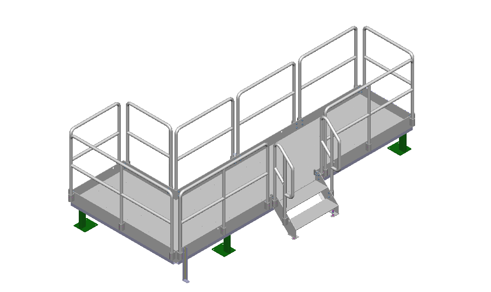
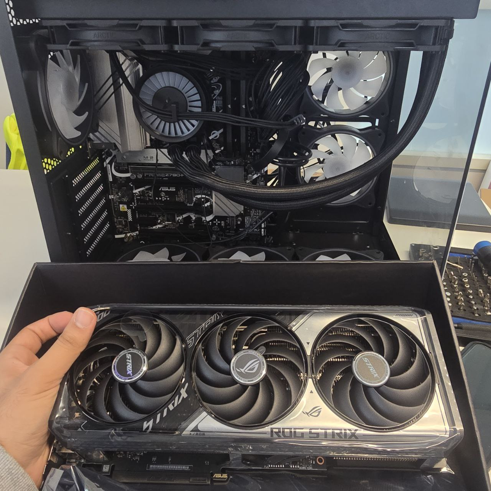
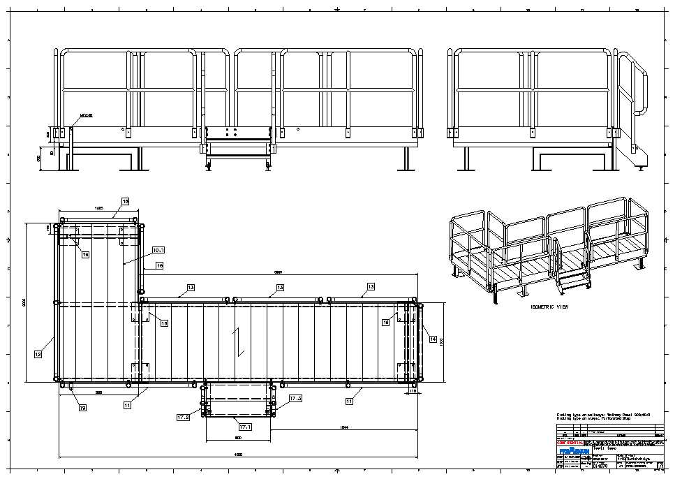
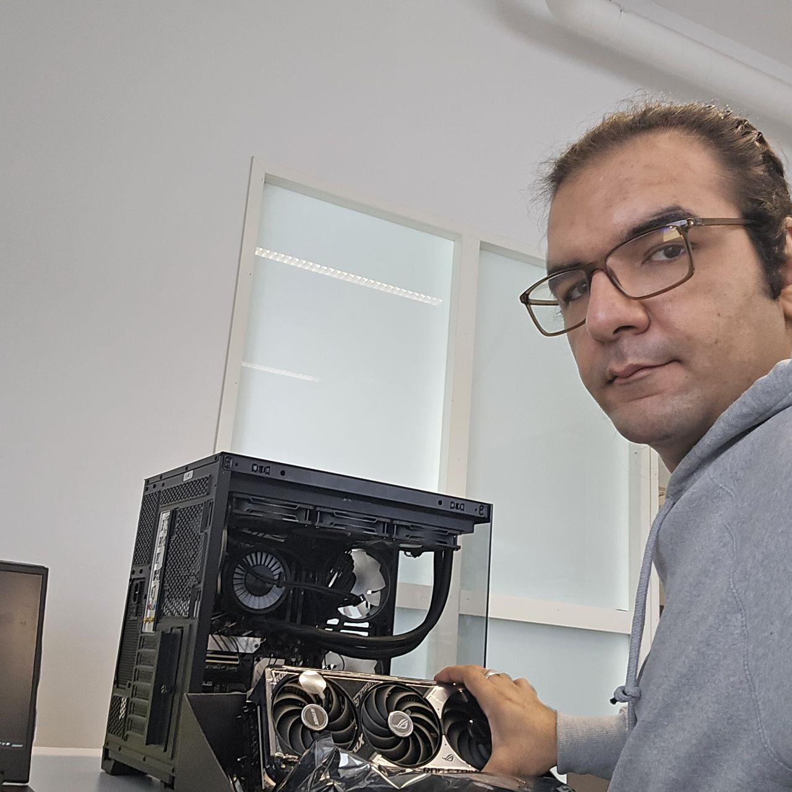

# Smart-platform
we want to integriate AI with platform to increase the safty 
# Work Log – Premekon Smart Service Platform Project  
© Premekon Oy – Confidential  

---

## Friday, 15 August 2025
- Employment start date.  
- Introduction to Premekon premises and project objectives.  
- Reviewed project documentation: *Smart Service Platform* concept, safety regulations, and planned AI-based features.  
- Initial preparation for workstation build and component inventory check.
  
https://github.com/user-attachments/assets/0c6daf9b-133c-443c-865e-dee059413a22

---

## Monday, 18 August 2025
- Began hardware assembly process.  
- Installed **ASUS PRIME Z790-P WIFI motherboard** in PC case.  
- Mounted **Intel Core i9-14900KS CPU** onto the motherboard socket.  
- Applied thermal paste and prepared **ARCTIC Liquid Freezer III 360 A-RGB water cooling** system.  
- Installed radiator and fans into the case.

---

## Tuesday, 19 August 2025
- Installed **64 GB DDR5 6600 MHz RAM** (2 × 32 GB modules) in DIMM slots.  
- Inserted **Samsung 990 PRO NVMe M.2 1TB SSD** into M.2 slot with heatsink.  
- Connected **Cooler Master MWE Gold 1250W PSU** to motherboard, CPU, and GPU power rails.  
- Managed internal cabling for airflow and safety compliance.  

---

## Wednesday, 20 August 2025
- Mounted **ASUS ROG Strix RTX 5070 Ti GPU**.  
- Connected DisplayPort cable to monitor for initial testing.  
- Verified all power and cooling connections.  
- Performed first boot → BIOS successfully recognized CPU, GPU, RAM, and storage.  

---

## Thursday, 21 August 2025
- Continued hardware validation.  
- Adjusted BIOS settings:  
  - Enabled **XMP** for DDR5 RAM at 6600 MHz.  
  - Checked CPU and motherboard temperature stability.  
- Installed **case fans** and verified ARGB control.  
- Performed stability test at BIOS level.

---

## Friday, 22 August 2025
- Completed hardware assembly.  
- Conducted final cable management and safety checks.  
- Confirmed PSU power efficiency and cooling system performance.  
- Hardware build finalized and ready for software installation.

---

## Monday, 25 August 2025
- Installed **Windows 11 Pro** operating system.  
- Installed required drivers: motherboard chipset, GPU (NVIDIA), and cooling system control.  
- Installed and configured essential software:  
  - **Python, CUDA Toolkit, cuDNN**  
  - **PyTorch, TensorFlow, JupyterLab**  
  - **OpenCV, YOLOv8, Detectron2, Segment Anything (SAM), Optical Flow libraries**  
  - **Visual Studio Professional, .NET SDK**  
  - **Roboflow, Edge AI SDKs**  
  - Productivity tools: **Microsoft 365, VS Code, GitHub Desktop, TeamViewer Business**  
  - Utility tools: **CCleaner Pro, Driver Booster Pro, Bitdefender/Kaspersky, Macrium Reflect**  
- System fully operational and development environment prepared for AI and machine vision tasks.  

---

## Summary (15–25 August 2025)
- Successfully completed **hardware assembly** of the AI workstation.  
- Installed **Windows 11 Pro** and configured full software stack for AI, machine learning, and productivity.  
- Workstation is now ready for upcoming tasks: developing and testing the *Smart Service Platform* AI models.  
