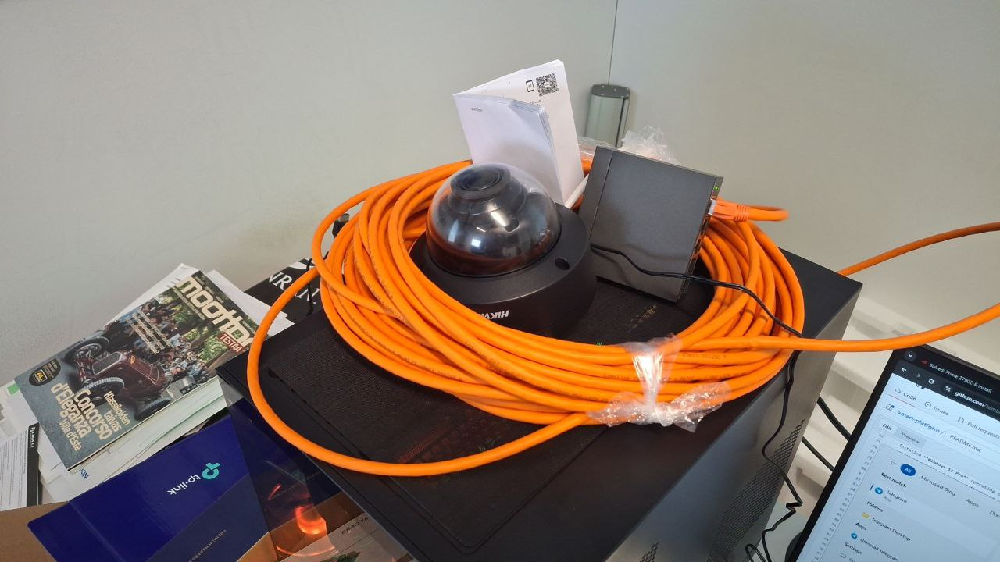
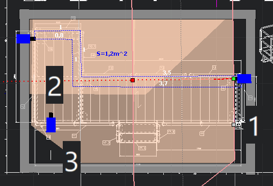
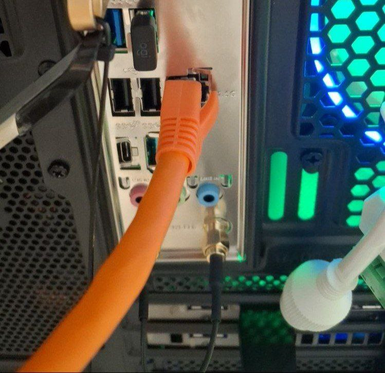
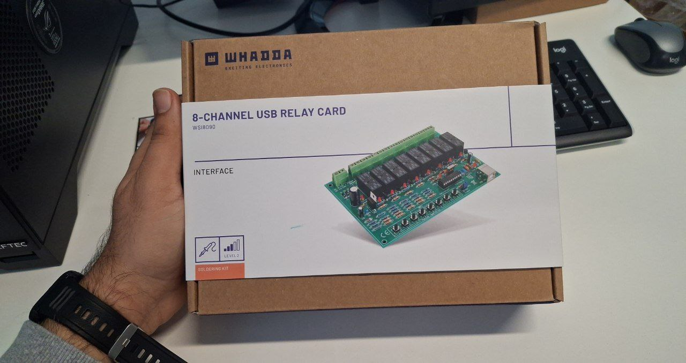
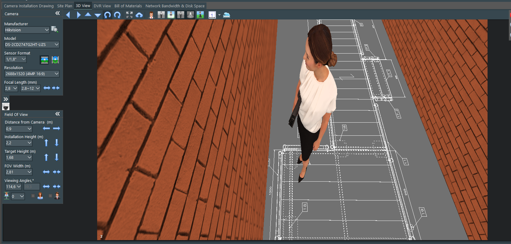

# Smart-platform
we want to integriate AI with platform to increase the safty 
# Work Log – Premekon Smart Service Platform Project  
© Premekon Oy – Confidential  
For investigating the structure : 
- website: https://sharecad.org/
- 2D: https://github.com/tembooo/Smart-platform/blob/main/Cad2.dwg
- 3D: https://github.com/tembooo/Smart-platform/blob/main/Cad1.stp

---

## Friday, 15 August 2025
- Employment start date.  
- Introduction to Premekon premises and project objectives.  
- Reviewed project documentation: *Smart Service Platform* concept, safety regulations, and planned AI-based features.  
- Initial preparation for workstation build and component inventory check.
  
https://github.com/user-attachments/assets/0c6daf9b-133c-443c-865e-dee059413a22

---

## Monday, 18 August 2025
- Began hardware assembly process.  
- Installed **ASUS PRIME Z790-P WIFI motherboard** in PC case.  
- Mounted **Intel Core i9-14900KS CPU** onto the motherboard socket.  
- Applied thermal paste and prepared **ARCTIC Liquid Freezer III 360 A-RGB water cooling** system.  
- Installed radiator and fans into the case.

---

## Tuesday, 19 August 2025
- Installed **64 GB DDR5 6600 MHz RAM** (2 × 32 GB modules) in DIMM slots.  
- Inserted **Samsung 990 PRO NVMe M.2 1TB SSD** into M.2 slot with heatsink.  
- Connected **Cooler Master MWE Gold 1250W PSU** to motherboard, CPU, and GPU power rails.  
- Managed internal cabling for airflow and safety compliance.  

---

## Wednesday, 20 August 2025
- Mounted **ASUS ROG Strix RTX 5070 Ti GPU**.  
- Connected DisplayPort cable to monitor for initial testing.  
- Verified all power and cooling connections.  
- Performed first boot → BIOS successfully recognized CPU, GPU, RAM, and storage.  

---

## Thursday, 21 August 2025
- Continued hardware validation.  
- Adjusted BIOS settings:  
  - Enabled **XMP** for DDR5 RAM at 6600 MHz.  
  - Checked CPU and motherboard temperature stability.  
- Installed **case fans** and verified ARGB control.  
- Performed stability test at BIOS level.

---

## Friday, 22 August 2025
- Completed hardware assembly.  
- Conducted final cable management and safety checks.  
- Confirmed PSU power efficiency and cooling system performance.  
- Hardware build finalized and ready for software installation.

---

## Monday, 25 August 2025
- Installed **Windows 11 Pro** operating system.  
- Installed required drivers: motherboard chipset, GPU (NVIDIA), and cooling system control.  
- Installed and configured essential software:  
  - **Python, CUDA Toolkit, cuDNN**  
  - **PyTorch, TensorFlow, JupyterLab**  
  - **OpenCV, YOLOv8, Detectron2, Segment Anything (SAM), Optical Flow libraries**  
  - **Visual Studio Professional, .NET SDK**  
  - **Roboflow, Edge AI SDKs**  
  - Productivity tools: **Microsoft 365, VS Code, GitHub Desktop, TeamViewer Business**  
  - Utility tools: **CCleaner Pro, Driver Booster Pro, Bitdefender/Kaspersky, Macrium Reflect**  
- System fully operational and development environment prepared for AI and machine vision tasks.  

---

## Tuesday, 26 August 2025
- Researched **depth and position estimation** methods for cameras (stereo vs. monocular cues, homography, and PnP).  
- Worked on **camera mapping**: planned calibration steps (checkerboard, intrinsic/extrinsic parameters) and region layout for the site.  
- Drafted approach to define **safe vs. dangerous zones** in the scene for worker detection/alerts.  

## Wednesday, 27 August 2025

- Tested the **camera with my laptop**; confirmed the **motherboard LAN port** doesn’t work.  
  - Decided to order a **PCIe Ethernet (LAN) card** as a practical fix.  
  - ASUS can accept a motherboard return, but it would take longer.  
  - Similar issue reported by another user (see: [ASUS Forum](https://rog-forum.asus.com/t5/intel-700-600-series/prime-z790z-p-install-no-lan-found/td-p/1046937)).  
- Prepared the **PoE switch** for the cameras.  
- Crimped and tested **Cat6 cables** using **T568B** wiring—ready to deploy.  

### Items to order / finalize
- **PCIe LAN card**  
- **M.2 drive**  
- **Measuring tools** (tape/laser distance meter)  
- **Region definitions**: finalize the **safe** and **danger** areas on the site map  

I’ll send this procurement list to **Toni** today.

## Summary (15–25 August 2025)
- Successfully completed **hardware assembly** of the AI workstation.  
- Installed **Windows 11 Pro** and configured full software stack for AI, machine learning, and productivity.  
- Workstation is now ready for upcoming tasks: developing and testing the *Smart Service Platform* AI models.  
## Thursday, 28 August 2025
- Activated Windows and installed the JVSG application.  
- Tested the cables and cameras.  
- Connected and activated cameras with the laptop; adjusted camera features.  
- Held a progress meeting with the company and Aki.  
- Reported the LAN port issue on the motherboard.  
- Researched PCIe LAN cards, memory options, and necessary tools.  
- Toni Kontele placed the material orders.  
- Downloaded required drivers and software from the internet.  

## Friday, 29 August 2025
- Received the LAN PCIe card and external NVMe SSD; installed both.  
- Downloaded and installed the LAN card driver.  
- Prepared LAN cables using the T568B standard and tested them with a multimeter.  
- Transferred equipment to the basement; configured two cameras and adjusted features.  

## Monday, 1 September 2025
- Meeting with Professor Lasse regarding optimal camera placement.  
- Discussed two options for RGB cameras:  
  - **Single camera with homography.**  
  - **Stereo camera model.**  
- Considered the use of an Intel RealSense RGB-D depth camera:  
  - Advantage: depth sensing capability.  
  - Limitations: fixed focal length and narrower FoV, which may not fully cover the site.  
  - Model referenced: *Intel RealSense D457, Min Depth 0.06 m, Max Range 6 m (RS Stock No. 265-0903, Part No. 82635DSD457).*  
  - Links for camera options: https://fi.rsdelivers.com/browse/ppe-safety-test-it/computing-peripherals/photography-drones/depth-cameras  
- Professor suggested using **NVIDIA Omniverse** to create a live 3D site map.  
- Researched best possible placement of cameras for maximum coverage.  

## Tuesday, 2 September 2025
- Structure of the platform was completed; received ordered tools.  
- Held meeting with Nick about the platform progress.  
- Prepared LAN setup and adjusted camera range/IPS settings.  
- Ran simulations for camera height and focal length.  
### Challenges
- Need to identify and select a **suitable cable** for transferring electricity between the adapter and the switch.  

